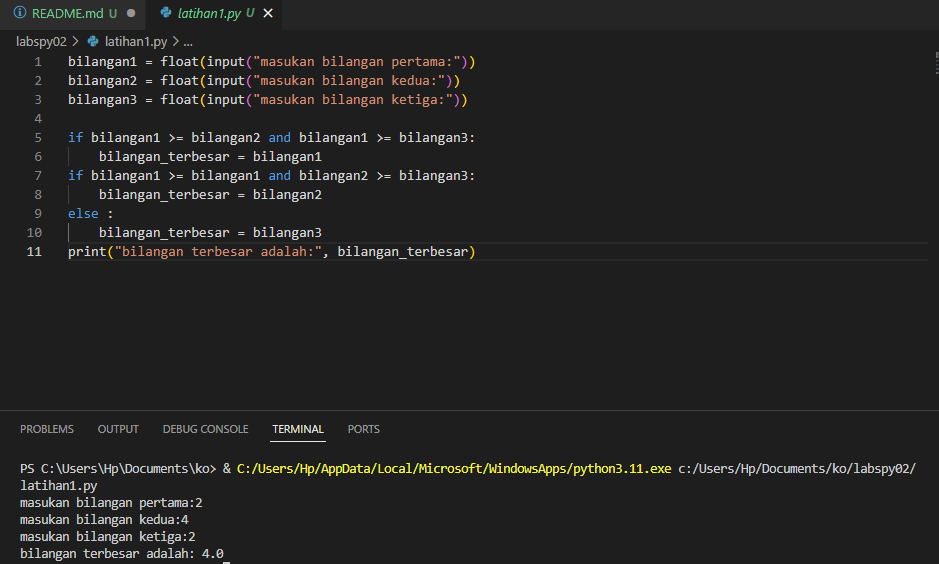
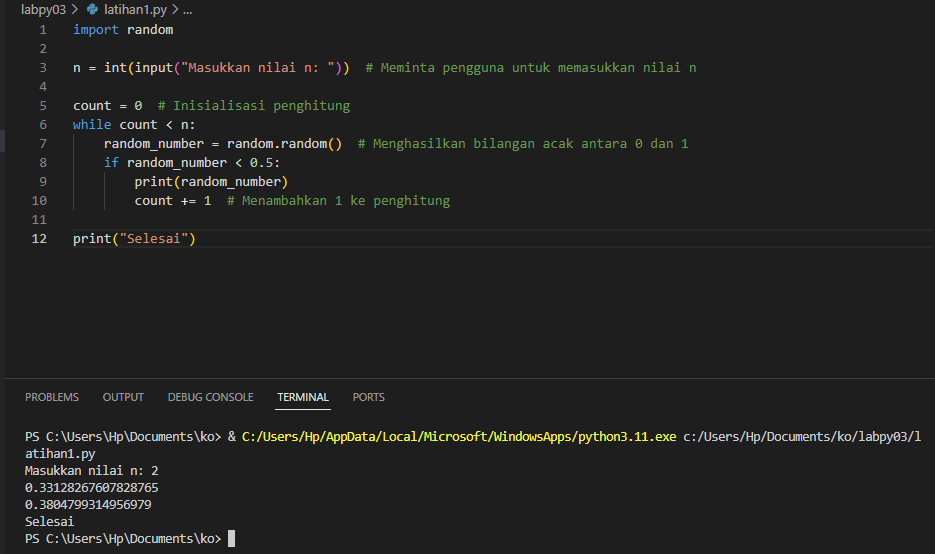
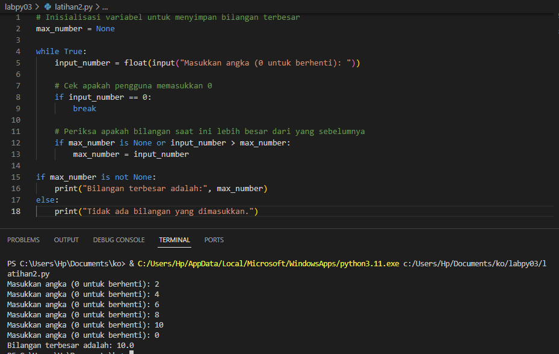
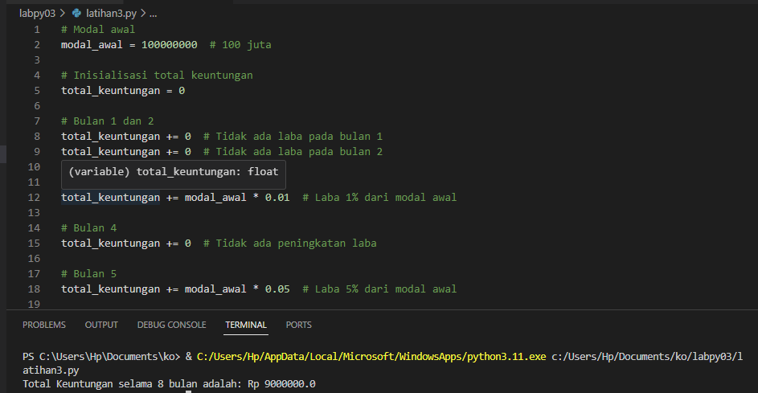
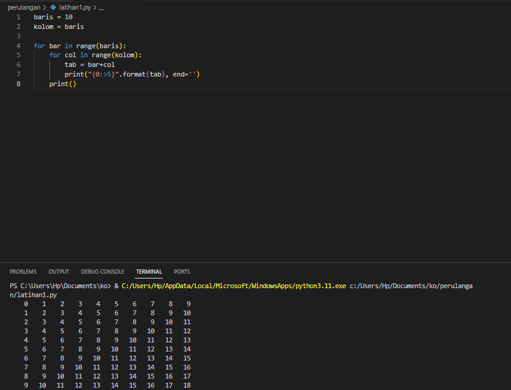
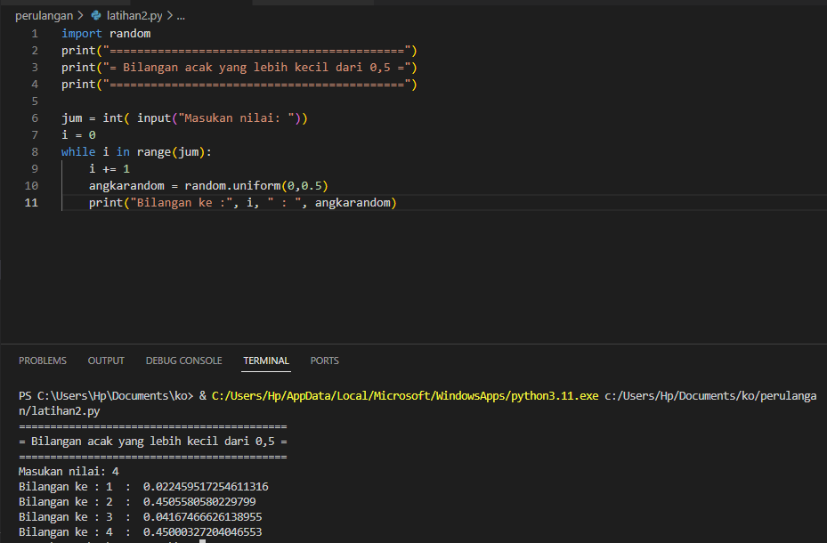

# Installation Environmet virtual (venv) Dan Deaktivate Di Visual Studio Code
# labs02py
# Pertama
* program meminta pengguna untuk memasukan 3 bilangan menggunakan input(), dan hasilnya disimpan di dalam variabel bilangan1, bilangan2, dan bilangan3. kemuadian, program memerikasa tiga kondisi menggunakan if:

# Kedua 
* memeriksa apakah bilangan1, bilangan2, dan bilangan3 ?. jika benar, maka bilangan1 yang terbesar

# ketiga
* jika kondisi pertama salah, maka memeriksa apakah bilangan2 lebih besar dari pada bilangan1 dan bilangan3. jika benar, maka bilangan2 yang terbesar. jika kedua kondisi kedua sebelumnya salah, maka bilangan3 yang terbesar. hasil bilangan terbesar menggunakan pernyataan print.

# outputnya

* Dengan demikian, program akan menentukan bilangan terbesar di antara ketiga bilangan yang dimasukkan oleh pengguna dan mencetaknya ke layar.

# labpy03

# Latihan 1

# Latihan 2

# Latihan 3

# Perulangan 
# Latihan 1
* kolom = baris: variabel kolom juga diatur sama dengan baris. ini berarti bahwa segitiga yang dihasilkan akan memiliki jumlah kolom yang sama dengan jumlah baris
* Loop pertma (for bar in range(baris)) digunakan untuk mengiterasi melalui setiap baris segitiga. variabel bar akan berubah dari 0 hingga 9 
* Loop kedua (for col in range(kolom)) digunakan untuk mengiterasi melalui setiap kolom sgitiga. variabel col akan berubah dari 0 hingga 9
* Tab = bar + col: variabel tab digunakan untuk menghitung jumlah baris dalam kolom saat ini. ini kana menghasil nilai yang bertambah sacara berurutan dengan setiap baris dan kolom yang ditambah.

# latihan 2

# Pengerjaan

